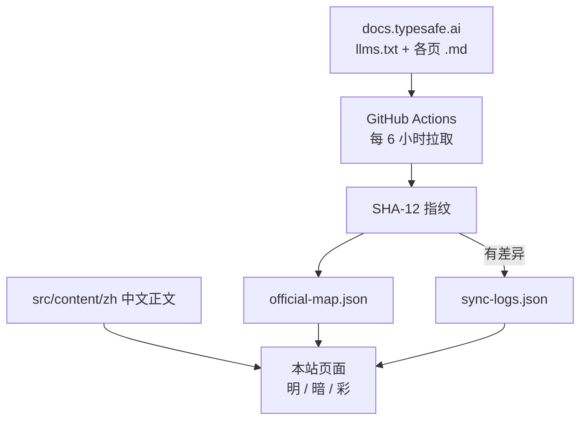

# 本站架构

> TypeSafe 官方文档的中文阅读站：对照官网指纹，有变动就单独记一条同步日志，写明改了什么、本站在哪一页。

本站不是官网镜像。正文是中文译本，路径尽量和 [docs.typesafe.ai](https://docs.typesafe.ai/introduction) 对齐，额外加了三页本站自己的内容：同步日志、对照表、本页。

## 页面怎么拼

| 层 | 作用 |
| --- | --- |
| `src/content/zh/**/*.md` | 中文正文。首页是 `introduction.md`，其余按官网路径。 |
| `src/lib/docs/catalog.ts` | 侧栏目录、标题、本站 URL、官网路径。 |
| `src/lib/docs/official-map.json` | 每一页的内容哈希。官网 `.md` 一变，对照表那一行变成「待更新」。 |
| `src/lib/docs/sync-logs.json` | 每次对照后的独立日志：改了什么、侧栏哪一项、本站哪个 URL。 |
| `DocsShell` | 顶栏、侧栏、搜索、主题切换、正文渲染。 |

内部链接写成官网那种 `/concepts/system-one`，渲染时改成本站 `/docs/concepts/system-one`。首页是 `/`。

## 官网一更新会怎样

1. 工作流每 6 小时（也可手动）跑 `scripts/sync-docs.ts`。
2. 拉取 `https://docs.typesafe.ai/llms.txt`，再拉每一页 `.md`，算 SHA-12。
3. 和上一份 `official-map.json` 比。哈希变了 → 这一页「待更新」。
4. 只要有新增、改动或删除，就往 `sync-logs.json` **前面**插一条新日志，字段包括：
   * **改了什么**：标题 + slug
   * **在 Web 哪个位置**：侧栏分区 → 标题 · 本站 URL
   * **官网链接**、前后哈希、说明
5. 有变动才 commit。然后重新构建 GitHub Pages。

JS SDK 自动生成的类页（`sdk/javascript/api/*` 子页）故意跳过，避免把参考手册淹没在几百个类文件里。Python API 子页收进 [Python API 参考](/sdk/python/api)。

## 三种风格

顶栏 **明 / 暗 / 彩**。选择存在浏览器 `localStorage` 的 `typesafe-handbook-theme`。架构图会跟主题色重绘。

## 发布

预览用 `npm run dev`。GitHub Pages 静态包用 `npm run build:pages`，基路径 `/typesafe-handbook/`。线上地址：

[https://gradient30.github.io/typesafe-handbook/](https://gradient30.github.io/typesafe-handbook/)

TypeSafe 是 [typesafe.ai](https://typesafe.ai) 的产品。本站是非官方中文阅读器，不替代官方文档。
