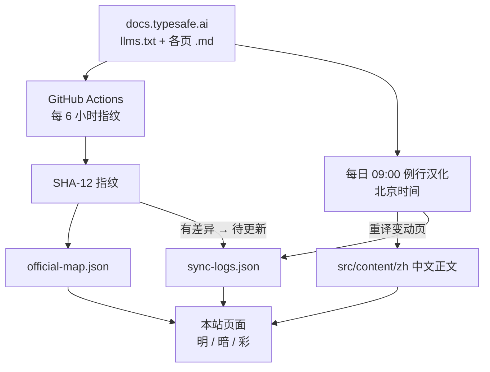

# 本站架构

> TypeSafe 官方文档的中文阅读站：指纹对照不停，变动页每天重译，每条日志写明改了什么、本站在哪一页。

本站不是官网镜像。正文是中文译本，路径尽量和 [docs.typesafe.ai](https://docs.typesafe.ai/introduction) 对齐，额外加了三页本站自己的内容：同步日志、对照表、本页。

## 永久汉化怎么跑

两层接力，缺一层都会停：

| 层 | 节奏 | 做什么 |
| --- | --- | --- |
| 指纹对照 | 每 6 小时 | 拉 `llms.txt` 和各页 `.md`，算 SHA-12。哈希变了，对照表那一行变成「待更新」，同步日志先记一条。 |
| 例行汉化 | 每天 09:00 北京时间 | 对照指纹，把新增/改动页写成中文，更新 `translatedAtHash`，再记一条「已汉化」日志并推送仓库。 |

概念页（简介、原语、模式、SDK、API）整页重译。食谱只更新架构、结论和关键代码，不搬 30–70 KB 实验日志。JS SDK 自动生成的类页跳过。

无变动的日子也会刷新「上次对照」时间，但不会往日志里堆空条目——今天启动例行时写过一条，之后只在真有差异时追加。

## 页面怎么拼

| 层 | 作用 |
| --- | --- |
| `src/content/zh/**/*.md` | 中文正文。首页是 `introduction.md`，其余按官网路径。 |
| `src/lib/docs/catalog.ts` | 侧栏目录、标题、本站 URL、官网路径。 |
| `src/lib/docs/official-map.json` | 每一页的内容哈希。官网 `.md` 一变，对照表那一行变成「待更新」。 |
| `src/lib/docs/sync-logs.json` | 每次对照或重译后的独立日志：改了什么、侧栏哪一项、本站哪个 URL。 |
| `src/lib/docs/cadence.json` | 例行节奏、上次对照、译本是否和官网一致。 |
| `DocsShell` | 顶栏、侧栏、搜索、主题切换、正文渲染。 |

内部链接写成官网那种 `/concepts/system-one`，渲染时改成本站 `/docs/concepts/system-one`。首页是 `/`。

## 官网一更新会怎样

1. 6 小时指纹任务跑 `scripts/sync-docs.ts`，对照表先亮「待更新」。
2. 当天（或次日 09:00）例行汉化拉取英文原文，写入对应 `src/content/zh/{slug}.md`。
3. 往 `sync-logs.json` **前面**插一条新日志，字段包括：
   * **改了什么**：标题 + slug
   * **在 Web 哪个位置**：侧栏分区 → 标题 · 本站 URL
   * **官网链接**、前后哈希、说明
4. 推送后 GitHub Pages 重建。顶栏「同步」日期就是最近一次对照。

## 三种风格

顶栏 **明 / 暗 / 彩**。选择存在浏览器 `localStorage` 的 `typesafe-handbook-theme`。架构图会跟主题色重绘。

## 发布

GitHub Pages 基路径 `/typesafe-handbook/`。线上地址：

[https://gradient30.github.io/typesafe-handbook/](https://gradient30.github.io/typesafe-handbook/)

TypeSafe 是 [typesafe.ai](https://typesafe.ai) 的产品。本站是非官方中文阅读器，不替代官方文档。
