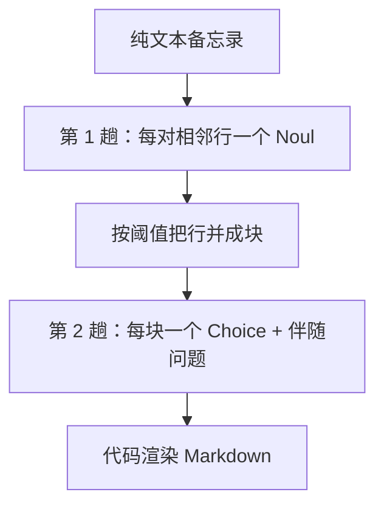

# 结构恢复

> 用两次请求从丢掉格式的纯文本还原 Markdown：一次把硬换行缝回去，一次给每个块分类（标题、列表、代码、提示框），伴随问题只在相关时才读。

## 问题

一份团队备忘录进了纯文本收件箱：句子中间被硬换行，没有标题标记、没有列表符号。生成模型可以重写成 Markdown，但也会改字。这里模型从不生成文本：只回答关于文档的窄问题，代码负责渲染。输出的每个字符都来自输入，每次判断都带概率。

## 架构

每份文档两次 API 请求，串行：

1. **缝合：** 每对相邻行一个 Noul（「这一行是不是接上半句？」），全部放进一次请求。被空行隔开的对跳过。
2. **分类：** 每个缝好的块一个 Choice（标题 / 段落 / 列表项 / 引文 / 代码 / 提示框），外加标题层级、步骤顺序、提示框种类等伴随问题。类型还不知道，等它们意味着第三次往返，所以伴随问题提前问；用不上的答案直接丢掉。

空行和显式标记（`- `、`1.`、`#`）在代码里读，不送给模型。这份备忘录留着空行，但标记全丢了。



## 结论

28 个非空行 → 17 块（缝合 11 处换行）。第 1 趟 16 对问题、一次请求、0.32s。第 2 趟 62 个问题、17 块、一次请求、0.51s。附录：两次往返，10,211 token，0.8s，$0.0015。`jev-1.12`。

悬挂行（无句末标点）后面，接合概率 ≥ 0.2 就合并；句末标点后阈值升到 0.5。连续列表项的步骤概率均值 ≥ 0.5 则编号，否则加点。那条未标记的医生脚本警告被分成 `callout` / `warning`。

## 关键代码

第 1 趟每个相邻对一个窄 Noul：

```python
def join_question(i: int) -> Noul:
    return Noul(
        instructions=f"Does line {line_id(i)} pick up mid-sentence, continuing a sentence left unfinished at the end of line {line_id(i - 1)}?",
        criteria=NoulCriteria(
            true="The line starts in the middle of a sentence that began on the previous line - the line break tore the sentence apart",
            false="The line begins a new sentence, item, heading, or thought of its own",
        ),
    )
```

第 2 趟每个块一个类型 Choice；标题层级、步骤、提示框种类同一次请求发出，按类型选用。

```python
questions[f"type_{bid}"] = Choice(
    instructions=f"What kind of content is block {bid}?", criteria=TYPE_CRITERIA
)
questions[f"step_{bid}"] = Noul(
    instructions=f"Is block {bid} an instruction in a sequence where the order of the items matters?",
    criteria=NoulCriteria(
        true="It is one step of a procedure - the items around it must happen in order",
        false="Order is irrelevant - it is a loose collection, or not a list item at all",
    ),
)
```

完整实验与数据见官网原文：[结构恢复](https://docs.typesafe.ai/cookbooks/autoformat)
