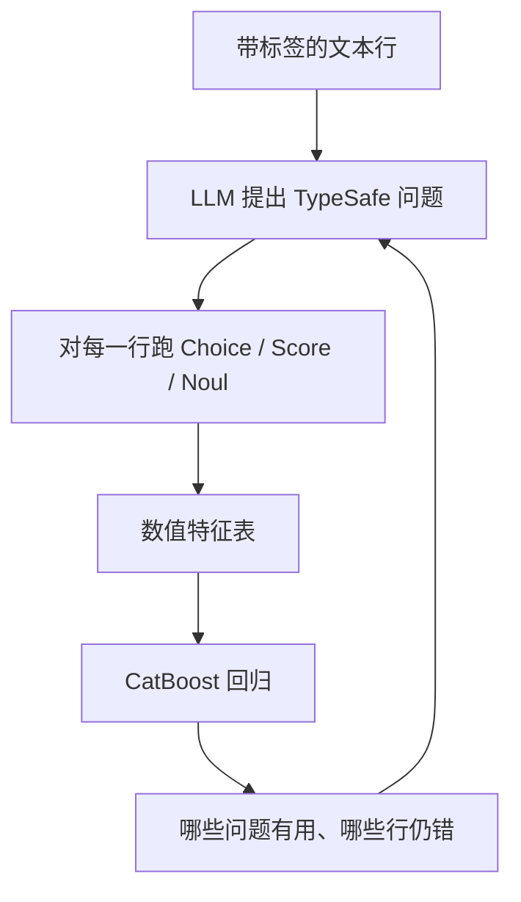

# 自动研究特征发现

> 提出 TypeSafe 问题，把文本变成数值特征，用模型误差改进监督回归。

## 问题

CatBoost 要的是数字表，品酒笔记不是。这份食谱用「对笔记提问」来建表，而且问题不是人手写的。LLM 提出问题，TypeSafe 对每一行作答，CatBoost 用这些答案训练。自动研究是下一步：CatBoost 报告用了哪些问题、哪些行还错，下一轮提案读这份报告，循环再来。

结束时你有一个可以指向自己标注文本的循环、每轮留出误差曲线，以及最终模型最常用的问题表。

## 架构



每一问都是一个特征：Noul 给 0–1，Score 给等级，Choice 可以 one-hot 或用获胜选项的概率。模型误差回流给提案步骤，所以后面几轮会针对仍然分错的行发明新问题，而不是重复已经有用的那些。

## 结论

循环把自由文本变成监督模型能吃的数。食谱画出每轮留出误差，并列出最终回归用得最多的问题。具体曲线和酒评数据集数字见官网 notebook。这是「System One 输出作为经典模型特征」的完整例子，也写在 [如何构建](/concepts/how-to-build-with-system-one) 里。

## 关键代码

```python
from typesafe_sdk import Choice, Noul, Score, TypeSafeClient

def features_for(note: str, questions: dict) -> dict[str, float]:
    with TypeSafeClient() as client:
        response = client.system_one(state={"note": note}, questions=questions)
    row = {}
    for name, answer in response.answers.items():
        if answer.type == "noul":
            row[name] = answer.noul
        elif answer.type == "score":
            row[name] = answer.score
        elif answer.type == "choice":
            row[name] = answer.probabilities[answer.choice]
    return row
```

完整实验与数据见官网原文：[Autoresearch feature discovery](https://docs.typesafe.ai/cookbooks/autoresearch_feature_discovery)
