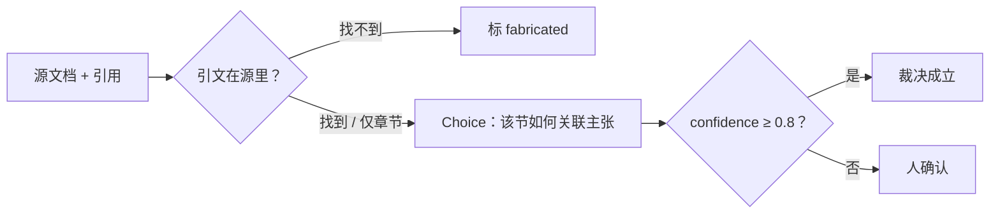

# 核对引用

> 对照源文档抓住错误或幻觉引用。一个 TypeSafe Choice 判断引文上下文是否支撑主张，其置信度可以把引用标给人审。

## 问题

LLM 答题并附引用：每条主张对应源文档的一节和它所依据的引文。有些引用是错的或编的：引文可能根本不在文档里，或原文一字不差但上下文说的和主张相反。

手工核对慢。自动化先用普通字符串匹配找缺失引文，再用 Choice 读每条存活引文的上下文，判断是否支撑主张。

## 架构

两步。引文不在源里 → `fabricated`，不用模型。匹配（或只有主张、没有引文）→ 一个 Choice：该节如何关联主张。选项最高概率是裁决；`AUTO_ACCEPT` 0.8 决定是否自动接受。



四个裁决：`verified`、`unsupported`、`contradicted`、`fabricated`。

## 结论

RFC 7519（JSON Web Token）上 8 条引用，`jev-1.12`（2026-08-16）。四条准确的以置信度 ≥ 0.93 回来 `verified`。四条植入失败全抓住。

| 引用 | 引文 | 关系 | 置信度 | 裁决 | 动作 |
| --- | --- | --- | --- | --- | --- |
| epoch_seconds | found | supports | 0.93 | verified | auto |
| aud_reject | found | supports | 0.95 | verified | auto |
| sig_reporting | missing | — | — | fabricated | auto |
| clock_skew | found | supports | 0.99 | verified | auto |
| exp_required | found | contradicts | 0.99 | contradicted | auto |
| pii_encryption | found | says_nothing | 0.27 | unsupported | review |
| iat_future | section-only | says_nothing | 0.56 | unsupported | review |
| duplicate_names | found | supports | 0.99 | verified | auto |

`exp_required` 一字不差引用 4.1.4 节，同一节写着「Use of this claim is OPTIONAL」，所以是 `contradicted`。`pii_encryption` 说明为什么字符串匹配不够：引文在源里，该节对主张只字未提。字符串匹配在规范化后是精确的；截断或轻微改写会回来 `fabricated`。

## 关键代码

一个 Choice 覆盖一节对主张的三种关系。缺失引文永不调用模型。

```python
QUESTIONS = {
    "relation": Choice(
        instructions="How does the section relate to the claim?",
        criteria={
            "supports": "The section states the claim or directly implies that it is true",
            "contradicts": "The section states the opposite of the claim or implies it is false",
            "says_nothing": "The section does not address what the claim asserts, either way",
        },
    ),
}

def verdict(status: str, answer: dict | None) -> dict:
    if status == "missing":
        return {"verdict": "fabricated", "confidence": None, "auto": True}
    return {
        "verdict": RELATION_TO_VERDICT[answer["choice"]],
        "confidence": answer["confidence"],
        "auto": answer["confidence"] >= AUTO_ACCEPT,
    }
```

完整实验与数据见官网原文：[核对引用](https://docs.typesafe.ai/cookbooks/citation_check)
