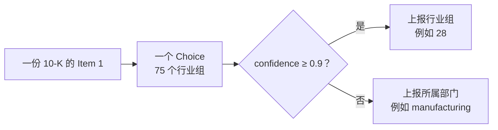

# 分类用置信度

> 用一个 Choice 把 SEC 年报分到 75 个行业组，再读答案自己的置信度，决定上报该组还是上一级部门。

## 问题

每家公司在 10-K 的 Item 1「业务」里描述自己。按标准产业分类（SIC）把这些描述分到 75 个行业组，每份文件一个 Choice。

多数申报很清楚：区域银行就是区域银行。难的是刚卖掉两个板块之一的公司，或是在写打算进入、而不是正在经营的业务。模型必须选出一个组，难例和易例的答案长得一样。区分它们通常要第二模型、额外调用或人工。[Choice](/primitives/choice) 已经带了答案：[置信度](/confidence) 高表示概率几乎全落在一个选项，低表示散在几个选项上。

## 架构

SIC 是层级：444 个四位数行业 → 75 个大组（前两位）→ 10 个部门。部门由大组的固定区间推出，不用模型。模型对组没把握时，上报它所在的部门。宽标签由窄标签推出，不用第二次调用。Choice 大约到 240 个选项仍可靠，75 远在范围内。



读 `confidence`，不是赢家自己的概率：赢家 0.45、第二名 0.44，和赢家 0.45、其余摊得很薄，是两种情况。

## 结论

60 份申报（1993–2024，平均 1,438 词），`jev-1.12`（2026-08-12）。标签是申报人自报、且正文能撑住该代码的子集，所以数字衡量的是食谱，不是 EDGAR 元数据的老化程度。置信度 0.9 把样本对半切开。

| 策略 | 结果 |
| --- | --- |
| 每次都强制点名一个组 | 39/60 正确 |
| 其中有把握的 30 份 | 27/30 正确（90%） |
| 其中没把握的 30 份 | 12/30 正确（40%） |
| 没把握时改报部门 | 48/60 仍可用（没把握的那半 40% → 70%） |

有把握的三份置信度 1.00：药厂、寿险、公用事业。没把握的三份 0.22–0.29：两家处于筹备期、一家刚卖掉一个板块。部门对应用来说太粗时，这个分支就是交给人的地方。

## 关键代码

一个 Choice，选项就是 75 个组。`classify()` 是整份食谱：有把握报组，否则报该组所在部门。

```python
QUESTION = (
    "Which broad industry does this company operate in? Judge the company's own operations "
    "as this filing describes them."
)

def questions() -> dict:
    return {
        "group": Choice(
            instructions=QUESTION,
            criteria={group: describe(group) for group in sorted(GROUPS)},
        )
    }

def classify(filing: dict) -> dict:
    answer = ask(filing["id"], filing["text"])
    sure = answer["confidence"] >= CONFIDENT  # 0.9
    return {
        "level": "group" if sure else "division",
        "label": answer["group"] if sure else division(answer["group"]),
        "confidence": answer["confidence"],
        "group": answer["group"],
    }
```

完整实验与数据见官网原文：[分类用置信度](https://docs.typesafe.ai/cookbooks/classification_using_confidence)
