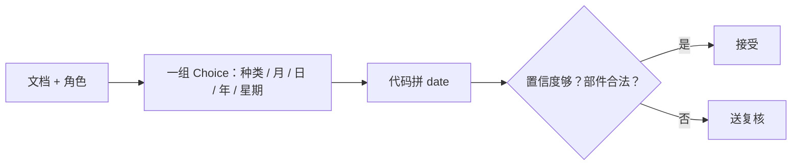

# 日期抽取

> 让 TypeSafe 点名文档里的日期部件，再在代码里解析并按置信度复核。

## 问题

函数 `extract_date(document, role)` 吃一份文档和一个角色短语（例如「交回表格的截止日期」），吐出一个 `date` 和置信度。低置信度、部件拼不成日期、文档根本没写日期，都标出来给人看。日期可以写全（"August 14, 2027"），也可以相对今天（"tomorrow"、"next Thursday"）。

## 架构

TypeSafe 一次调用回答一组 Choice：这是哪种日期，以及文本点了哪个月、日、年、星期。代码把答案拼成 `date`。模型只读文本里写了什么，**不做日历运算**。相对日期从今天起算。



这正是 [Jev 1.13 锯齿](/model-jaggedness/jev-1.13) 建议的拆法：抽取给模型，算术给代码。每个部件都是小闭集，还可以显式放「未写明」。

## 结论

食谱对四份短文档跑这个函数，打印日期和置信度，再分成「代码接受」和「人来看」两堆。相对日期（明天、下周四）和缺部件的情况会被挡下来，而不是猜一个。

## 关键代码

```python
from typesafe_sdk import Choice, TypeSafeClient

def date_questions(role: str) -> dict:
    return {
        "kind": Choice(
            instructions=f"How is the date for `{role}` written?",
            criteria={
                "absolute": "A calendar date with month/day/year",
                "relative": "A relative date such as tomorrow or next Thursday",
                "not_stated": "The document does not name this date",
            },
        ),
        "month": Choice(
            instructions=f"Which month does the text name for `{role}`?",
            criteria={str(i): None for i in range(1, 13)} | {"not_stated": None},
        ),
        "day": Choice(
            instructions=f"Which day of month does the text name for `{role}`?",
            criteria={str(i): None for i in range(1, 32)} | {"not_stated": None},
        ),
        "year": Choice(
            instructions=f"Which year does the text name for `{role}`?",
            criteria={"2025": None, "2026": None, "2027": None, "not_stated": None},
        ),
    }
```

完整实验与数据见官网原文：[Date extraction](https://docs.typesafe.ai/cookbooks/date_extraction_cookbook)
