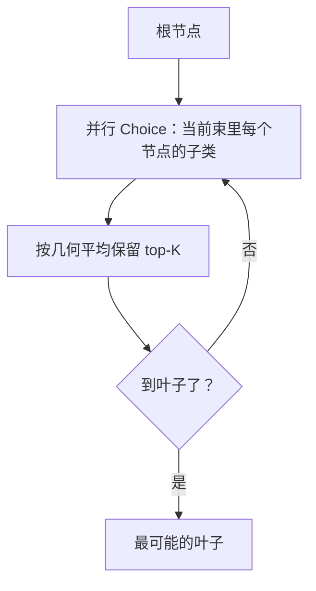

# 层级分类

> 在专利、零售、生物医学、源码层级上，用并行束搜索和 TypeSafe Choice 概率走到叶子。

## 问题

很多数据是层级：分类法、文件系统、网站、代码库、组织架构、生物本体、技能目录、审核政策。层级分类的目标是走到正确的叶子。这正好配 Choice：在每个节点上对文档分类，再沿最可能的子节点往下走（贪心搜索）。

## 架构

API 可以一次问多条路径。食谱用 **束搜索**：每一步同时评估 `K` 条路径，按边概率的几何平均保留最好的 K 条：`product(edge_probabilities) ** (1 / decisions)`，其余剪掉。概率按长度归一，浅叶子和深叶子才能公平比。



一次请求可以对束里所有待展开节点发 Choice，而不是一步一调用。

## 结论

食谱在专利、零售商品、生物医学、源码四套层级上跑。束搜索通常比纯贪心更能找到正确叶子，因为第一步选错的路径还有机会被后边的高概率边救回来。具体数字以官网 notebook 为准。

## 关键代码

```python
from math import prod
from typesafe_sdk import Choice, TypeSafeClient

def beam_step(state, paths, children_of, k: int):
    questions = {
        path: Choice(
            instructions=f"Which child of `{path}` does this document belong to?",
            criteria={c: None for c in children_of[path]},
        )
        for path in paths
    }
    with TypeSafeClient() as client:
        response = client.system_one(state=state, questions=questions)
    scored = []
    for path in paths:
        ans = response.answers[path]
        for child, p in ans.probabilities.items():
            edges = list(path_edge_probs[path]) + [p]
            score = prod(edges) ** (1 / len(edges))
            scored.append((score, path + "/" + child, edges))
    scored.sort(reverse=True)
    return scored[:k]
```

完整实验与数据见官网原文：[Hierarchical classification](https://docs.typesafe.ai/cookbooks/hierarchical_classification)
