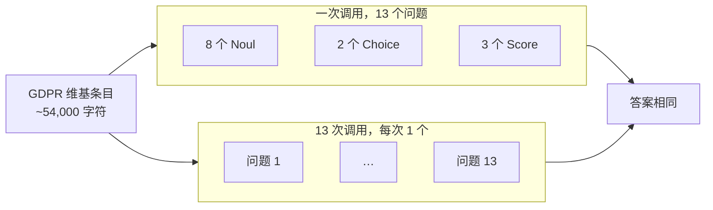

# 并行问题

> 对 GDPR 维基百科文章跑 13 个监管问题，证明把所有问题放进一次 TypeSafe 调用比逐条便宜 12.2 倍、快 10.0 倍，答案不变。

## 问题

一份文档、N 个问题。可以一次请求带上全部 N 个，也可以发 N 次、每次一个。TypeSafe 里两种做法答案相同：每个问题独立对照文档打分，不依赖同一次请求里还有什么。

这份食谱用 GDPR 维基百科文章（约 54,000 字符）当 state，合规团队要查 13 件事：8 个 Noul、2 个 Choice、3 个 Score。每种策略各跑 5 次，比均值（两边是否一致）和标准差（批处理是否加噪声）。

## 架构

一次调用混入三种原语，全部对着同一份 `article`。文档占每次请求的绝大部分；13 次单问题调用把文章发 13 遍，批量调用只发一遍。



## 结论

Choice、Score 以及 8 个 Noul 里的 6 个，5 次重复完全相同：两种策略标准差都是 0.0。`breach_72h` 和 `criminal_penalties` 有一点采样噪声，两边噪声量级一样，均值差在噪声内。批处理既不平移答案，也不加方差。

| 策略 | 调用次数 | 费用 | 总耗时 |
| --- | --- | --- | --- |
| 一次调用，13 个问题 | 1 | $0.000497 | 0.27s |
| 13 次调用，每次 1 个 | 13 | $0.006090 | 2.71s |

批处理便宜 12.2×、快 10.0×。若单问题调用并发发出，时延差距会缩小，但 13× token 费用仍在。模型是 `jev-1.12`。

## 关键代码

问题定义：8 个 Noul + 2 个 Choice + 3 个 Score，混在同一份 `QUESTIONS` 里。

```python
QUESTIONS = {
    "breach_72h": Noul(
        instructions="Must a personal data breach be reported to the supervisory authority within 72 hours?"
    ),
    "instrument_type": Choice(
        instructions="What kind of EU legal instrument is the GDPR?",
        criteria={
            "Regulation": "Directly binding law in all member states, no national implementation needed.",
            "Directive": "Sets goals that member states implement through national law.",
            "Treaty": "An international treaty between states.",
            "Recommendation": "Non-binding guidance.",
        },
    ),
    "penalty_severity": Score(
        instructions="How severe are the penalties the GDPR provides for non-compliance?",
        criteria=[
            "None: no penalties of any kind.",
            "Symbolic: small fixed fines unlikely to change behavior.",
            "Substantial: fines large enough to matter to most companies.",
            "Severe: fines scaled to global revenue, material even to the largest companies.",
        ],
    ),
}
```

`ask()` 一次 `system_one` 即可回答任意子集。Noul 取 `noul`，Choice 取最大概率，Score 归一化到 0–1。

```python
response = client.system_one(
    state={"article": DOCUMENT},
    questions={key: QUESTIONS[key] for key in keys},
    model=TYPESAFE_MODEL,
)
answer = response.answers[key]
if isinstance(answer, NoulAnswer):
    values[key] = answer.noul
elif isinstance(answer, ChoiceAnswer):
    values[key] = max(answer.probabilities.values())
else:
    values[key] = answer.score / (len(QUESTIONS[key].criteria) - 1)
```

完整实验与数据见官网原文：[并行问题](https://docs.typesafe.ai/cookbooks/parallel_questions)
