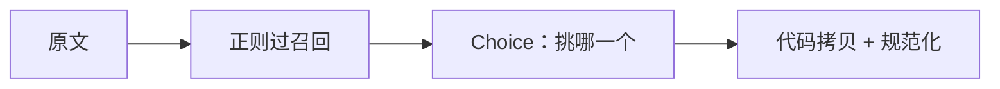

# 预解析值抽取

> 正则找候选邮箱、电话、金额，TypeSafe 选出要的那一段，代码原样拷贝并规范化。

## 问题

从文档里拿出一个**逐字**的值：收据要寄到哪个邮箱、电话要写成 `+14155550177`、发票总额是 `1315.50 USD` 且是扣款还是贷记。生成模型容易改写；这里要的是原文里的那一截。

## 架构

三步：

1. 正则在文本里找候选。宁可多找。
2. TypeSafe 从候选里挑问题要的那一个，并读出下游需要的属性（币种、国家、金额是贷还是扣）。
3. 代码把选中的候选原样拷走，再规范化。



TypeSafe 只能从你交给它的选项里选，所以候选必须先找到。正则负责召回，模型负责「问的是哪一个」。

## 结论

三份工作案例：寄收据的地址、`+14155550177` 格式的电话、发票总额 `1315.50 USD` 并标成扣款。值来自原文，不是模型生成的。

## 关键代码

```python
from typesafe_sdk import Choice, TypeSafeClient

def pick(document: str, role: str, candidates: list[str]) -> str:
    criteria = {c: None for c in candidates}
    criteria["none"] = "None of the candidates is the requested value"
    with TypeSafeClient() as client:
        response = client.system_one(
            state={"document": document, "role": role, "candidates": candidates},
            questions={
                "which": Choice(
                    instructions="Which candidate is the value requested by `role`?",
                    criteria=criteria,
                ),
            },
        )
    choice = response.answers["which"].choice
    return "" if choice == "none" else choice
```

完整实验与数据见官网原文：[Pre-parsed value extraction](https://docs.typesafe.ai/cookbooks/pre_parsed_value_extraction_cookbook)
