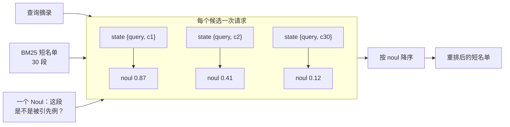

# 重排序

> 为 40 条 CLERC 法律查询各建 30 段 BM25 短名单，再用每对查询–候选一次 TypeSafe 问题，把 top-1 准确率从 5% 提到 18%，top-10 从 38% 提到 62%。

## 问题

几千份文档里找回答某一问的那一份。先用关键词之类的快方法把候选砍到短名单，再对短名单逐条对照查询打分、把最好的放到最前。快检索擅长缩小范围，分不清短名单里谁才对。

这份食谱在 CLERC 的 3,565 段法院意见上跑：BM25 为 40 条查询各建 30 候选短名单，TypeSafe 再重排。重排只重排已经在短名单上的 30 段，加不进快检索没选中的段落。这里 40 条查询的短名单都含正确段落，所以重排的任务是把它放到更好的位置。

## 架构

每对查询–候选一个 [Noul](/primitives/noul)：这段能不能就是查询摘录里被去掉的那条引用所指向的先例。noul 就是排序键。40 × 30 = 1,200 次独立调用，用线程池一起发出。每个请求看不到其他候选。



## 结论

`jev-1.12`。重排在每个阈值上都把正确段落往前推：

| 阈值 | 仅 BM25 | + TypeSafe 重排 |
| --- | --- | --- |
| top-1 | 5% | 18% |
| top-5 | 15% | 35% |
| top-10 | 38% | 62% |

1,200 次调用消耗 1,536,002 输入 token、25,200 输出 token，费用 $0.0645。语料由 170 行 CLERC 汇成共享库；每条评估查询的 BM25 从整库取 30 候选，不只是该行自带的 20 条负例。

生产里可对同一对一次调用问多个问题，见 [并行问题](/cookbooks/parallel_questions) 和 [投机扇出](/patterns/fan-out)。

## 关键代码

真正上线的问题比示意更窄：查询摘录来自去掉了引用的联邦法院意见，问候选段是否确立了摘录在引用点所援引的那条具体命题。

```python
is_cited_source = Noul(
    instructions=(
        "The query excerpt comes from a US federal court opinion and was written "
        "immediately around a citation to a precedent; the citation itself has been "
        "removed. Could the candidate passage be from that cited precedent — does it "
        "establish the specific legal proposition the query excerpt invokes at its "
        "citation point?"
    ),
    criteria=NoulCriteria(
        true=(
            "The candidate passage states or establishes the specific rule, standard, "
            "holding, or fact pattern that the query excerpt attributes to its removed "
            "citation."
        ),
        false=(
            "The candidate passage is merely on a similar topic or doctrine; it does not "
            "supply the specific proposition the query excerpt relies on."
        ),
    ),
)
response = client.system_one(
    state={"query_excerpt": query, "candidate_passage": candidate},
    questions={"is_cited_source": is_cited_source},
)
reranked = sorted(shortlist, key=lambda c: nouls[c], reverse=True)
```

完整实验与数据见官网原文：[重排序](https://docs.typesafe.ai/cookbooks/rerank_typesafe)
