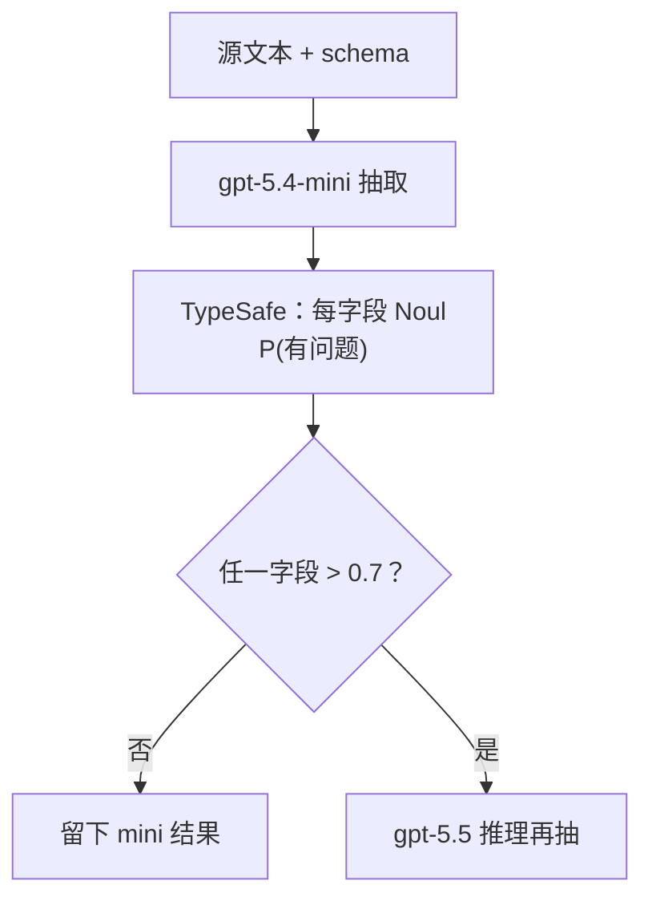

# SDE 级联

> 用两级结构化数据抽取级联（mini → 校验 → 推理）拿到接近大推理模型的质量，成本只是零头。

## 问题

大推理模型抽结构化数据很好，但慢且贵。小模型便宜，会犯错。级联在大部分质量下只付零头费用。JSON Schema 能抓住结构错误，抓不住语义错误：小模型会产出自信、符合 schema、却是编造的记录。

## 架构

1. 用便宜小模型抽取（`gpt-5.4-mini`，$0.75 / $4.50 每百万 token）。
2. 用 TypeSafe 校验：每字段是否 Noul（「这个值是不是源里没有？」「是不是从无关文字里抄的？」），每个返回 P(有问题)。
3. 任一校验信号开火则升级到推理模型（`gpt-5.5`，$5.00 / $30.00）；否则留下便宜答案。校验器是 `jev-1.12`（$0.042 / $0.00）。

整条记录的「该不该升级？」头会算、会展示，但门控不用它——升级由每字段电池驱动。`any_flag` 是 max 门：任一字段超过 `FIRE_T` 0.7 就升级，不被平均掉。



## 结论

端到端例子：NYU 秋季注册开放日。mini 留下空白日期（对：页面没写日期），但编造了描述「Registration opens for the fall semester」——schema 合法，语义错。TypeSafe 给 `description::hallucinated` 0.95、`description::off_target` 0.85；空日期的 `absence_wrong` 只有 0.14。门控升级。推理模型丢掉编造描述，返回 `""`。

100 条 scrapegraphai 提示上，扫门控阈值画出（成本，质量）前沿。级联前沿在每个单独模型的左上方：便宜档几乎免费处理简单项，只有被标记的项才付推理模型的钱。单独的 `gpt-5.5-reasoning` 大约 0.81 质量、每次抽取约 $0.10。

## 关键代码

每字段电池：非空字段走全套头，空字段只问 `absence_wrong`。`true` = 有问题（升级）。

```python
MAIN_QUESTIONS = {
    "hallucinated": (
        "Is the `extracted_field` unsupported by, or absent from, the source text?",
        NoulCriteria(
            true="the `extracted_field` is a hallucination -- not supported by, or absent "
            "from, the source text",
            false="the `extracted_field` is supported by the source text",
        ),
    ),
    "off_target": (
        "Does the source text fail to genuinely report the thing the `field_spec` describes, so the "
        "value was pulled from incidental text?",
        NoulCriteria(
            true="the source does not genuinely provide this field -- the value was pulled "
            "from incidental text",
            false="the source genuinely reports this field",
        ),
    ),
}

fired = {
    qid: p
    for qid, p in checks.items()
    if not qid.startswith("__overall__") and p > FIRE_T
}
escalate = bool(fired)
final_record = extract(REASONING, ...) if escalate else mini_record
```

完整实验与数据见官网原文：[SDE 级联](https://docs.typesafe.ai/cookbooks/sde_cascade)
