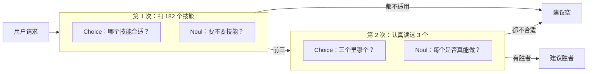

# 技能建议

> 从 Nous Research Hermes 目录的 182 个技能里，每个 agent 回合最多挑一个：一次 TypeSafe 请求给全部技能排序并判断这回合要不要技能，第二次认真读前三名，可以全拒。胜者名字写进 agent 系统提示的一行，错载和空载都降一半以上。

## 问题

技能多的 agent 几乎没信息就做选择。名册是索引：每技能一行，描述截到 60 字符，以免挤掉对话。编辑 `.pptx` 的技能和撰写 `.pptx` 的技能在这个宽度下几乎一样。没有技能合适时，它仍可能随便载一个，因为一列名字会诱人去猜。

## 架构

渐进披露，描述本身不动。两次 TypeSafe 请求挡在载入决定前面。第一次用一行摘要给 182 个技能排序，并问这回合要不要技能。第二次只读前三，带上完整描述和说明书开头，可以全拒。胜者名字加进系统提示一行；名册本身不变，前缀缓存仍有效。



门槛：门控 Noul 均值 < 0.30 则不建议；短名单最高 `fits` noul < 0.30 则丢掉。

## 结论

488 条请求对 `claude-haiku-4-5-20251001`，技能来自 Hermes 名册。315 条恰好由一个技能覆盖，173 条什么都不覆盖。`jev-1.12`。

| 运行 | 载错技能 | 不该载却载了 |
| --- | --- | --- |
| 仅 agent，只有名册 | 16.8% | 9.8% |
| agent + TypeSafe 建议 | 7.3% | 4.0% |
| 直接把正确答案交给 agent | 2.5% | 1.2% |

基线 → TypeSafe：错载少 2.3×，空载少 2.4×。315 条覆盖请求里建议修好 37 条、弄坏 7 条。第三行是下限：即使给对技能，agent 也不总会载；任何选择方法都过不了这道。

## 关键代码

第一次请求：对 182 个名字做 Choice，外加三个关于「要不要行动」的 Noul。

```python
questions = {
    "which": Choice(
        instructions=CHOICE_INSTRUCTIONS,
        criteria={skill["name"]: skill["description"] for skill in ROSTER},
    )
}
for key, text in GATE_QUESTIONS.items():
    questions[f"gate::{key}"] = Noul(instructions=text)
```

`suggest()` 是整份食谱：两次请求、两个门槛，最多返回一个技能名。

```python
def suggest(request: str) -> tuple[str, ...]:
    wide = rank_wide(request)
    if wide["gate"] < GATE_THRESHOLD:
        return ()
    shortlist = tuple(name for name, _ in wide["ranked"][:SHORTLIST])
    result = rerank(request, shortlist, EXCERPT_CHARS)
    if max(result["fits"].values()) < FITS_THRESHOLD:
        return ()
    return (result["winner"],)
```

完整实验与数据见官网原文：[技能建议](https://docs.typesafe.ai/cookbooks/skill_suggestion)
