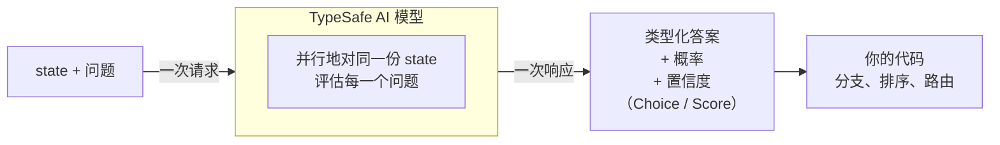

# 简介

> Jev 是 TypeSafe 的旗舰模型，也是第一款 System One 模型。传入 state 和类型化问题，直接拿结构化答案，代码可以立刻使用。

大语言模型（LLM）是为「给人读的文本」训练的。当你需要模型做一次判断、并且这份判断要交给代码消费时，就会出现错位：你在逼一个生成系统吐出结构化决策，再把结果解析回代码能依赖的形状。

Jev 是 TypeSafe 的旗舰模型，也是第一款 [System One 模型](/concepts/system-one)。System One 模型为软件做快速、结构化的决策。Jev 用类型化的 *问题* 去评估一份 *state*，直接返回结构化结果。没有文本生成，也没有解析。你拿到的是类型化取值和概率分布，代码可以按它分支、排序、路由。Choice 和 Score 还会返回 [置信度](/confidence)，用来决定要不要、以及如何根据答案行动。

## TypeSafe 原语

TypeSafe 暴露三种 *AI 原语*。和软件原语一样：模块化、可组合、结构化、可靠、快。每种原语问一类 *问题*，返回一类答案。

| 问题类型 | 目标 | 返回 |
| --- | --- | --- |
| [Choice](/primitives/choice) | 从给定集合里选一项 | `choice`、`probabilities`、`confidence` |
| [Score](/primitives/score) | 按有序量表给 state 打分 | `score`、`probabilities`、`confidence` |
| [Noul](/primitives/noul) | 这句话是真的吗？ | `noul`（0–1） |

三种 *问题* 可以混在同一次 API 调用里。每个问题都针对同一份 *state* 并行、隔离地评估。多加几个问题，响应时间几乎不变。问题彼此独立，不会因为堆在一起而发生 context-rot。

## 原子问题，在代码里组合

System One 最擅长的，是每个问题只问一件范围清楚的事。把它想成「有经验的人拿到足够上下文后几秒钟就能做的直觉判断」。

如果这个问题需要长推理，或同时权衡多个独立因素，就拆开。每个因素单独问，再用代码里的逻辑把结果合起来。这样每一次评估都更稳，权重也完全由你控制。

例如，不要问「给这份创业路演打分」，而是分别问市场规模、技术可行性、差异化，再用你自己的公式合成。优先级变了，改代码里的系数就行，不用重写提示词。

## 下一步

* [快速开始](/introduction/quickstart) — 最短上手路径：Playground、HTTP API、SDK。
* [AI 入门](/introduction/machine-learning-primer) — 为什么 TypeSafe 训练校准决策模型，而不是优化生成文本。
* [原语（问题）](/primitives) — 如何定义问题，在 Choice / Score / Noul 之间选择，一次问多个。
* [Confidence](/confidence) — 确定性怎么报告，以及如何用它做架构决策。
* [模式](/patterns) — 用 TypeSafe 搭系统的常见架构。
