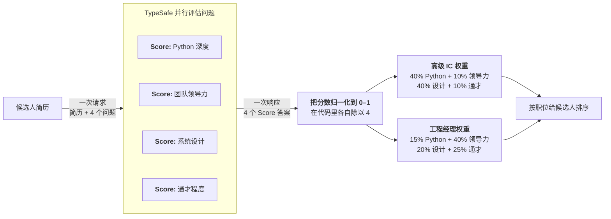

# 组合评分

> 把复杂判断拆成原子分数，用代码里由你控制的权重合成。

我们经常要按若干标准同时给一组条目排序。组合评分是一种简单的想法：把判断拆成独立维度，分别打分，再用代码里由你控制的权重合成。

## 例子：简历筛选 {#example-resume-screening}

假设你在处理工程岗位的简历。你想按若干标准给候选人排序，最终选出前 X 名进入下一轮审核。



### 第一步：独立给每个维度打分 {#step-1-score-each-dimension-independently}

```json
{
  "questions": {
    "python_depth": {
      "type": "score",
      "instructions": "How much depth of python experience does this candidate have, based on the supplied resume?",
      "criteria": [
        "No Python experience mentioned",
        "Mentioned but no detail",
        "Used in projects, some specifics",
        "Primary language, multiple projects",
        "Deep expertise: architecture, performance, libraries"
      ]
    },
    "team_leadership": {
      "type": "score",
      "instructions": "How much experience does this candidate have managing or leading engineering teams?",
      "criteria": [
        "No management experience mentioned",
        "Informal mentorship or tech lead role",
        "Led a small team or project",
        "Managed a team with direct reports",
        "Managed multiple teams or an engineering org"
      ]
    },
    "system_design": {
      "type": "score",
      "instructions": "How much experience does this candidate have designing large-scale or distributed systems?",
      "criteria": [
        "No architecture work mentioned",
        "Contributed to design discussions",
        "Designed components of a larger system",
        "Owned architecture of a significant system",
        "Designed systems at scale across multiple domains"
      ]
    },
    "generalist": {
      "type": "score",
      "instructions": "How much evidence is there that this candidate picks up unfamiliar tools, roles, or domains outside their core specialty?",
      "criteria": [
        "Only one domain or role mentioned",
        "Some variety but within a narrow field",
        "Worked across a few different areas or tech stacks",
        "Regularly moved between domains, wore many hats",
        "Track record of ramping up in unfamiliar areas and delivering"
      ]
    }
  }
}
```

### 第二步：用权重合成 {#step-2-combine-with-weights}

每个维度归一化到 0–1 再加权。权重让你可以调整各维度的相对重要性，同时不丢掉单个分数的细微差别。

```python
py      = response.answers["python_depth"].score / 4
lead    = response.answers["team_leadership"].score / 4
arch    = response.answers["system_design"].score / 4
general = response.answers["generalist"].score / 4

# 高级 IC
ic_score = (0.40 * py) + (0.10 * lead) + (0.40 * arch) + (0.10 * general)

# 工程经理
em_score = (0.15 * py) + (0.40 * lead) + (0.20 * arch) + (0.25 * general)
```

这样你就能按组合分数给候选人排序。更重要的是，你能看清最终分数到底怎么算出来的。如果排名最高的候选人和预期对不上，就调整权重，找到合适的平衡。
