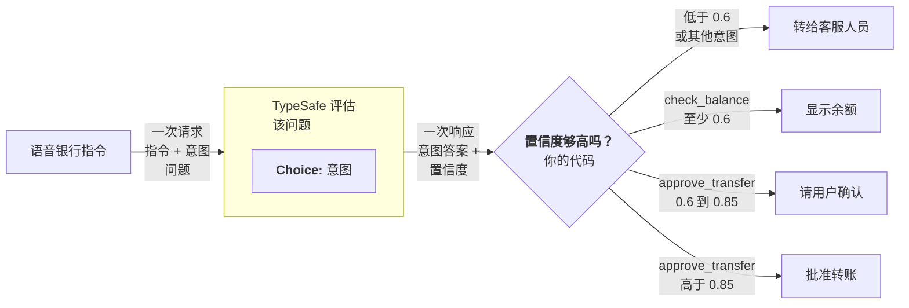

# 置信度门控路由

> 把置信度当成第二决策轴。答案告诉你「是什么」，置信度告诉你要不要动手。

TypeSafe 最有力的能力之一是 [置信度](/confidence)。有意识地用置信度给决策设门，就能搭出既可靠又安全的系统。

## 例子：语音银行指令 {#example-voice-banking-commands}

假设你在做一套语音银行界面，让用户口头操作账户。解读用户意图时你总希望有合理的置信度，但有些动作风险更高，因而需要更高的置信度阈值。



### 第一步：判断用户意图 {#step-1-determine-the-users-intent}

```json
{
  "questions": {
    "intent": {
      "type": "choice",
      "instructions": "What action is the user requesting?",
      "criteria": {
        "check_balance": "Check the balance of an account",
        "approve_transfer": "Approve the pending transfer request",
        "other": "Something else"
      }
    }
  }
}
```

### 第二步：置信度门控路由 {#step-2-confidence-gated-routing}

```python
action = response.answers["intent"]

# 任何动作置信度低于 0.6，都转给人工
if action.confidence < 0.6:
    route_to_support_agent(account_id)

elif action.choice == "check_balance":
    # 利害低。0.6 的置信度就够。
    show_balance(account_id)

elif action.choice == "approve_transfer":
    if action.confidence > 0.85:
        # 利害高，但置信度也高。可以自动执行。
        approve_transfer(account_id)
    else:
        # 利害高，置信度中等。先核对意图。
        ask_user_to_confirm("Just to confirm: you would like to approve this transfer, is that correct?")

else:
    route_to_support_agent(account_id)
```

0.6 的底线拦住模型真正不确定的一切。在这条底线之上，每种动作类型按「分类错了再行动」的后果设自己的阈值。查余额在 0.6 就可以，因为最坏情况只是用户听一遍余额播报。但批准转账需要非常高的置信度（>0.85），否则系统应当请用户确认。

如何在系统里思考置信度，详见 [Confidence](/confidence)。
