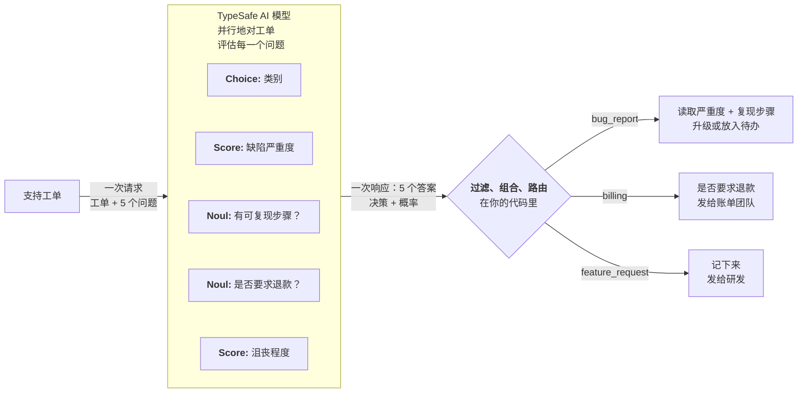

# 投机扇出

> 一次调用发出许多问题，包括投机性的，由代码决定哪些有用。

因为 TypeSafe 支持在一次 API 调用里发送许多问题，我们建议把系统需要的全部问题放进一次请求，事后再用代码决定哪些相关。所有问题并行评估，所以多加几个问题通常对响应时间影响很小。

## 例子：客服工单分诊 {#example-support-ticket-triage}

假设你在做一套客服系统，需要给工单分诊。你要把工单分到一个类别。如果是缺陷报告，还需要判断缺陷的严重度。

不要先问类别、再在后续调用里问严重度，而是两个一起问。如果工单不是缺陷报告，直接忽略缺陷严重度问题的结果。



### 第一步：投机扇出 {#step-1-speculative-fan-out}

```json
{
  "state": "Hi, I placed an order (#98423) last Thursday and was charged twice. I also can't log in after the site update, and adding Apple Pay would be really helpful. This is getting frustrating.",
  "questions": {
    "category": {
      "type": "choice",
      "instructions": "Determine the broad category of this support ticket",
      "criteria": {
        "bug_report": "The user is reporting something that is broken or producing errors",
        "billing": "Charges, invoices, refunds, subscriptions",
        "feature_request": "The user is requesting new functionality",
        "account": "Login, permissions, profile, security"
      }
    },
    "bug_severity": {
      "type": "score",
      "instructions": "How severe is the reported issue",
      "criteria": [
        "Cosmetic; no impact to functionality",
        "Broken or degraded feature; workaround exists",
        "Blocking issue; no workaround exists"
      ]
    },
    "has_reproducible_steps": {
      "type": "noul",
      "instructions": "The user describes specific steps to reproduce the issue"
    },
    "refund_requested": {
      "type": "noul",
      "instructions": "The user is explicitly asking for a refund or credit"
    },
    "frustration": {
      "type": "score",
      "instructions": "How frustrated the user appears",
      "criteria": ["Calm, matter-of-fact", "Frustrated but civil", "Very angry"]
    }
  }
}
```

> **投机性问题：** `bug_severity` 和 `has_reproducible_steps` 只在工单是缺陷报告时才有意义。`refund_requested` 只对账单有意义。我们一开始就全部带上，因为额外问题通常对响应时间影响很小。如果工单其实是功能请求，缺陷严重度结果就会无关，此时代码路径直接忽略它。

### 第二步：用代码路由 {#step-2-route-with-code}

代码根据分类结果决定哪些相关：

```python
category = response.answers["category"]
bug_severity = response.answers["bug_severity"]
bug_repro = response.answers["has_reproducible_steps"]
refund = response.answers["refund_requested"]
frustration = response.answers["frustration"]

if category.choice == "bug_report":
    if bug_severity.score > 1.5 and bug_repro.noul > 0.6:
        escalate_to_engineering(ticket_id, severity="high")
    else:
        add_to_bug_backlog(ticket_id)

elif category.choice == "billing":
    if refund.noul > 0.7:
        route_to_billing_with_flag(ticket_id, refund_likely=True)
    else:
        route_to_billing(ticket_id)

elif category.choice == "feature_request":
    log_feature_request(ticket_id)

# 沮丧程度不论类别都有用
if frustration.score > 1.5:
    flag_for_priority_response(ticket_id)
```

整棵决策树需要的东西都来自一次调用。投机性问题在无关时被忽略，在有关时省掉一次往返。
