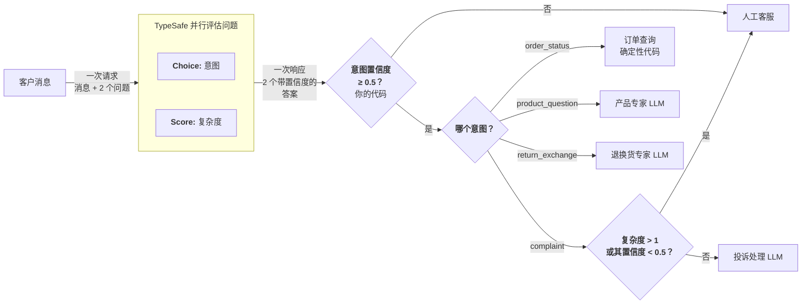

# 意图路由

> 给进来的请求分类，再把每一条路由到最合适的处理方：确定性逻辑、专用 LLM，或人工。

不是每条用户请求都需要同一种处理方。有的用一次数据库查询就能回答。有的需要带领域上下文的 LLM。有的需要人。TypeSafe 可以坐在所有这些前面，充当又快又便宜的分类器，决定调用哪一个处理方。

## 例子：客服路由 {#example-customer-service-routing}

假设你在做一套客服系统。消息进来，需要路由到正确的处理方。与其把每条消息都丢给昂贵的 LLM 去弄清它是哪种请求，不如先分类再按类路由。



### 第一步：给意图和复杂度分类 {#step-1-classify-intent-and-complexity}

```json
{
  "questions": {
    "intent": {
      "type": "choice",
      "instructions": "The primary intent of this customer message",
      "criteria": {
        "order_status": "Asking about an existing order",
        "product_question": "Asking about a product before buying",
        "return_exchange": "Wants to return or exchange something",
        "complaint": "Unhappy with experience, wants resolution"
      }
    },
    "complexity": {
      "type": "score",
      "instructions": "How complex is this request to resolve",
      "criteria": [
        "Simple lookup or standard procedure",
        "Requires some judgment or multi-step process",
        "Unusual situation, edge case, or escalation needed"
      ]
    }
  }
}
```

### 第二步：路由到最合适的处理方 {#step-2-route-to-the-optimal-handler}

```python
def route_ticket(ticket_id, response):
    intent = response.answers["intent"]
    complexity = response.answers["complexity"]

    if intent.confidence < 0.5:
        # 分类置信度不够，转给人工客服
        return route_to_human_agent(ticket_id)

    if intent.choice == "order_status":
        handle_order_status(ticket_id)

    elif intent.choice == "product_question":
        handle_with_llm(ticket_id, PRODUCT_SPECIALIST)

    elif intent.choice == "return_exchange":
        handle_with_llm(ticket_id, RETURNS_SPECIALIST)

    elif intent.choice == "complaint":
        low_confidence = complexity.confidence < 0.5
        # 更高的 complexity.score 偏向量表「需要升级」那一端。
        if complexity.score > 1 or low_confidence:
            # 太复杂，自动处理不安全；或者我们对复杂度没把握。转给人工。
            route_to_human_agent(ticket_id)
        else:
            handle_with_llm(ticket_id, COMPLAINT_RESOLUTION)
```

一种意图路由到完全不涉及 LLM 的确定性代码。两种路由到不同的专用 LLM，各自加载不同上下文。一种用复杂度分数在 LLM 和人工之间做选择。TypeSafe 在一次很快的调用里完成分类；昂贵的资源只为真正需要它们的请求调用。

注意对复杂度分数额外做了一次置信度检查。正如 [Confidence](/confidence) 所讨论的，始终要结合系统和决策的利害，去理解低置信度分数意味着什么。
